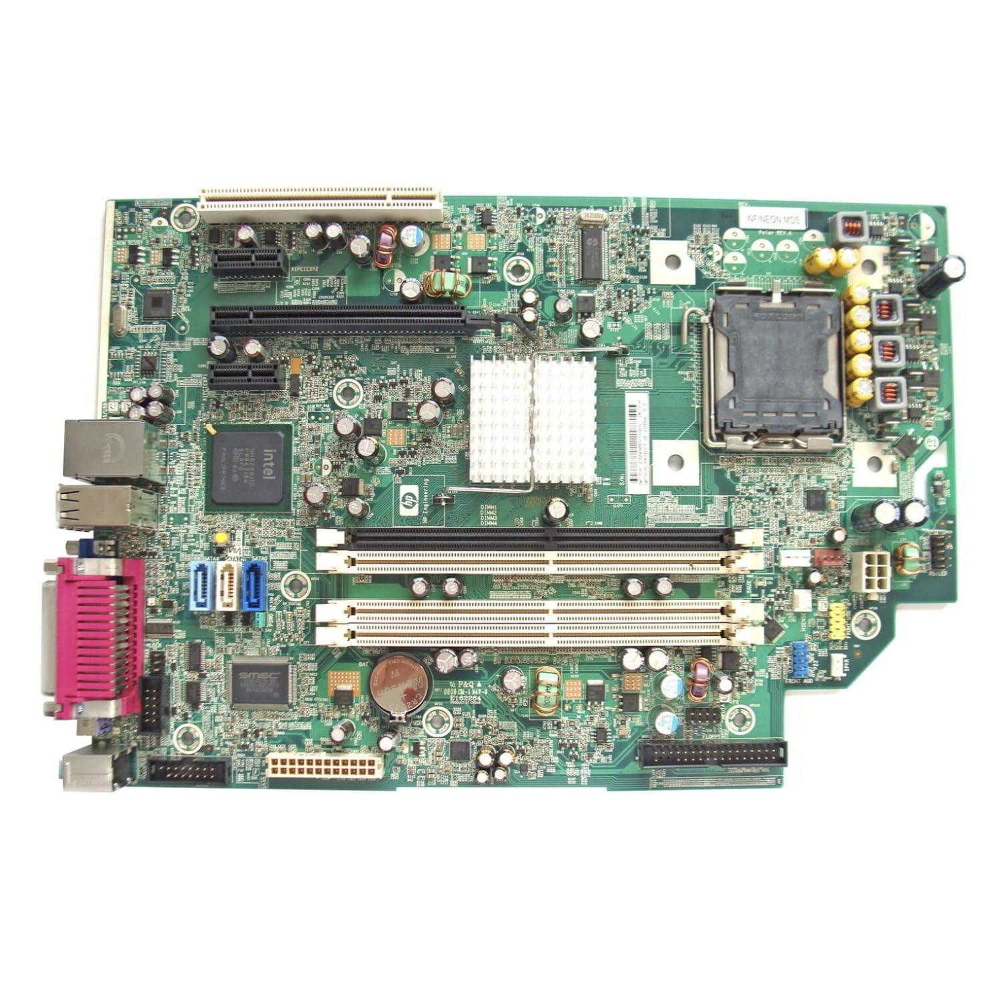
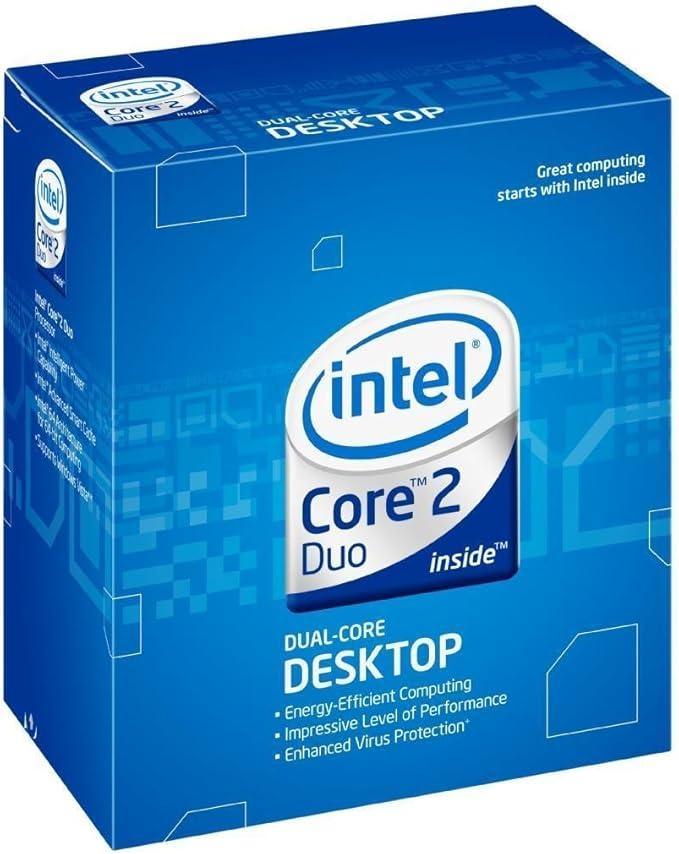
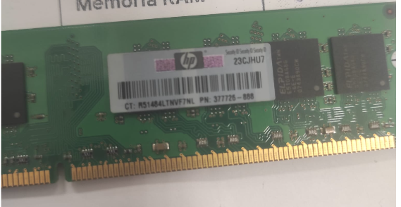
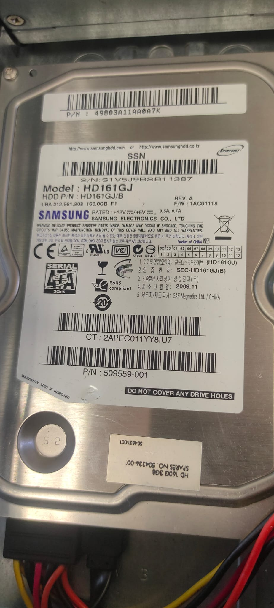
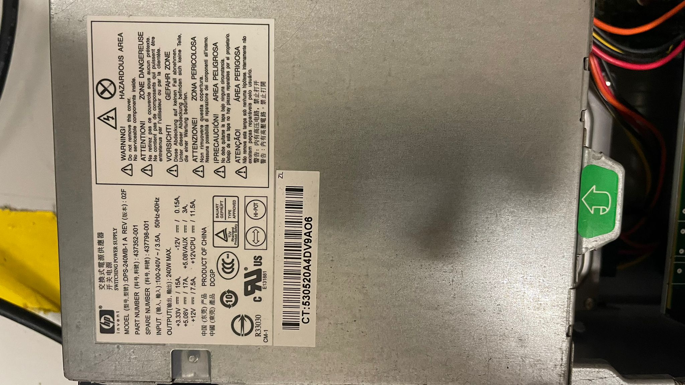
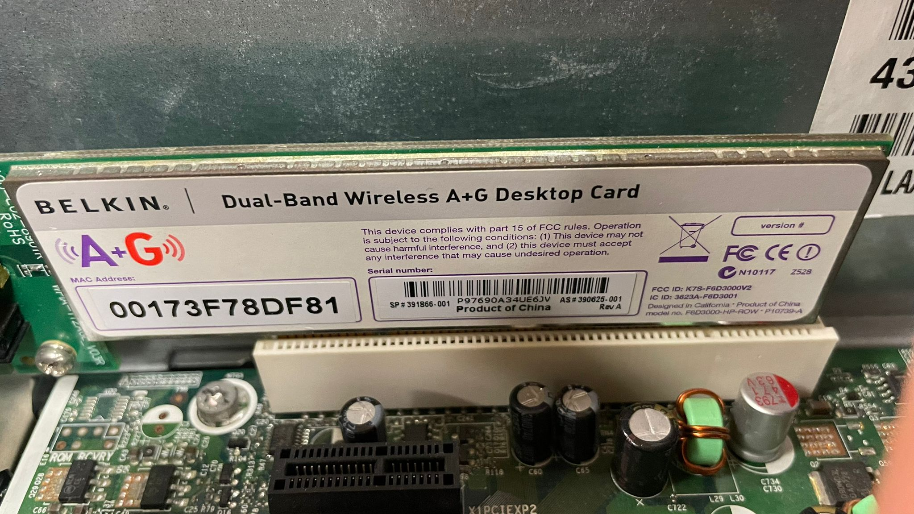

# 10 — Toma de datos (taller)

| **Componente**              | **Marca/Fabricante** | **Modelo/Serie**             | **Características técnicas visibles**                  | **Foto**                                                     |
| ----------------------------- | ---------------------- | ------------------------------ | ---------------------------------------------------------- | -------------------------------------------------------------- |
| **Placa base**              | HP                   | Compaq DC7800 SFF 437793-001 | Chipset Intel Q33 / Socket LGA775 / 4 slots RAM DDR2     |                                               |
| **Microprocesador**         | Intel                | Core 2 Duo E6750             | 2.66 GHz / 4MB Caché / 1333 MHz FSB                     |    |
| **Memoria RAM**             | HP (Elpida)          | P/N: 377726-888              | Tipo DDR2 / 1 GB / 667 MHz                               | retos/    |
| **Disco HDD/SSD**           | Samsung              | HD161GJ                      | Interfaz SATA 3.0Gb/s / 160 GB / 7200 RPM                |  |
| **Fuente de alimentación** | HP                   | 437352-001 / 437798-001      | Potencia 240 W / Sin certificación 80 Plus (Active PFC) |  |
| **Otros (GPU/Tarjetas)**    | Belkin               | F6D3000 (HP OEM)             | Tarjeta Wi-Fi PCI / 54 Mbps / 802.11 a/g                 |    |
