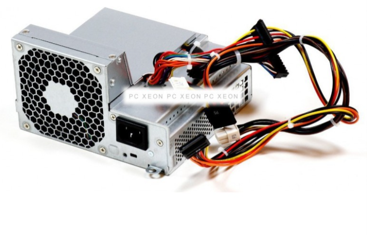
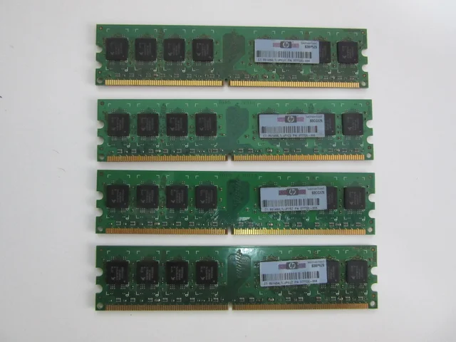
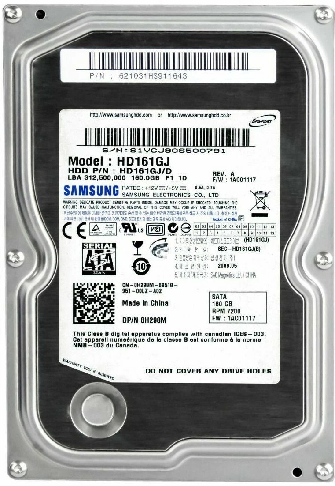

# 30 — Mercado y recambios

> Imagina que el equipo falla. Selecciona **tres** componente para recambio.

- **Componente a sustituir:** Fuente de Alimentación HP Compaq DC7800 SFF Series 240W 437352-001 437798-001
- **¿Existe el mismo modelo exacto en tiendas?:** Sí
- **Precio aproximado (€):** 75,00€
- **URL:** [pcxeon](https://pcxeon.com/es/hp/39545-fuente-de-alimentacion-hp-compaq-dc7800-sff-series-240w-437352-001-437798-001-5712505384978.html)
- **Captura:** 

- **Componente a sustituir:** Memoria RAM HP
- **¿Existe el mismo modelo exacto en tiendas?:** Solo segunda mano
- **Precio aproximado (€):** 7 €
- **URL:**[Wallapop](https://es.wallapop.com/item/4x-hp-4gb-ddr2-667mhz-memoria-ram-1183375565?srsltid=AfmBOoq5AhZdvJh6qi1JT6W8FJHRRDw432FXLZ5VeOBjEIQtBea7PZ1MhG0)
- **Captura:** 
- **Justificación breve:** No hay stock en tiendas por eso de segunda mano ademas me parece bien comprarla porque cuando se vio las memorias ram nos dimos cuenta de que llevan de diferentes modelos y marcas que no son del propio ordenador y esta es la original.
- **Componente a sustituir:** Disco duro SAMSUMG
- **¿Existe el mismo modelo exacto en tiendas?:** Solo segunda Mano
- **Precio aproximado (€):** 14,00 €
- **URL:**[Ebay](https://www.ebay.es/p/109089011)
- **Captura:** 
- **Justificación breve:** Hasta hace poco habia uno nuevo en Amazon pero al parecer ya no hay stock y como queria ir a por el disco original y no habia en mas tiendas pues al final lo e encontrado de segunda mano
