# 90 — ENTREGA ÚNICA (PDF)

## 00 — Portada

- **Alumno/a:Yllán Cazorla Más**  
- **Grupo: 1ºASIR Grupo de clase 1**  
- **Reto:** Puesta a Punto Low-Cost y Competitiva (Centro de Mayores) — **FOCO EN HARDWARE**  
- **Fecha: 08/02/2026**

## 01 — Índice

- [Portada](#portada)
- [1. Contexto](#1-introduccion)
- [2. Diagnostico inicial](#2-conectores-internos-energia)
- [3. Busqueda de mejoras](#3-conectores-de-datos)
- [3.1 Instalacion y postinstalación](#3.2)
- [4. Analisis mercado low cost](#4)
- [5. Plan presupuesto](#5)

---

## 02 — Contexto y requisitos

### Qué tienes que hacer
Redacta un **resumen breve** (6–10 líneas) con el **objetivo**, **restricciones** y **criterios de éxito**.
Nos han pedido de una residencia para mayores que con un presupuesto reducido consigamos reciclar los ordenadores antiguos de una institucion publica que ya no los necesitan. Para eso hemos hecho un diagnostico de los 5 ordenadores que nos han entregado y hemos decidido buscar mejoras para que se puedan usar para relacionarse y para ofimatica.
Nuestra primera idea es conseguir que tengan minimo los 4 slots de memoria funcionando pero como les falta a algunos habra que comprar.
Hemos buscado los modelos de fabrica de la RAM del PC y solo hemos podido encontrar de segunda mano a precio medio entre 7 y 9€ pack de 4x1GB lo cual dotaria a cada PC que lo necesite.

Como nuestro presupuesto es bajo solo compraremos 2 paquetes de 7€ para poder instalarla en los 3 ordenadores que les falta 1 de ellos se tendra de quedar con menos memoria pero bueno no podemos permitirnos mas.
[Wallapop](https://es.wallapop.com/item/4x-hp-4gb-ddr2-667mhz-memoria-ram-1183375565?srsltid=AfmBOoq5AhZdvJh6qi1JT6W8FJHRRDw432FXLZ5VeOBjEIQtBea7PZ1MhG0)
Con los 6€ restantes hemos decidido comprar pasta termica para poder hacerles un mantenimiento, Limpiar, ajustar cables y cambiar la pasta termica por tan solo 5,90€
[Amazon](https://www.amazon.es/Corsair-TM30-Rendimiento-Ventilador-intermedio/dp/B07KQ1T158/ref=asc_df_B07KQ1T158?mcid=b8c5952bf44834d582a4c55324582f28&tag=googshopes-21&linkCode=df0&hvadid=699690028239&hvpos=&hvnetw=g&hvrand=13011566057930331970&hvpone=&hvptwo=&hvqmt=&hvdev=c&hvdvcmdl=&hvlocint=&hvlocphy=9216036&hvtargid=pla-697512123760&hvocijid=13011566057930331970-B07KQ1T158-&hvexpln=0&th=1).
Como nesecitamos sistemas operativos de bajo rendimiento usariamos linux mynt. Estuve buscando mas sistemas operativos y se me ocurrio preguntarle a la ia si habia algun otro sistema operativo de bajo rendimiento que sirviera para los requisitos pedidos y me dio ChromeOS Flex que me parecio una buena idea pero me di cuenta de que al solo poder usar las aplicaciones de google no podrian usar bastantes aplicaciones.

## 10 — Diagnóstico inicial del lote

| **ID Equipo** | **CPU / Socket**          | **RAM (Instalada / Máx)** | **Almacenamiento**   | **Libres (slots RAM)** | **Estado Térmico (Reposo/Carga)**                | **Observaciones y Problemas**                       |
| --------------- | --------------------------- | ---------------------------- | ---------------------- | ------------------------ | --------------------------------------------------- | ----------------------------------------------------- |
| **01**        | Core 2 Duo E6750 / LGA775 | 4 GB                       | HDD 160 GB (Samsung) | 0 slots                | Sin medir. Estado de la pasta termica, desgastada | Polvo residual, falta antena wi-fi****              |
| **02**        | Core 2 Duo E6750 / LGA775 | 4 GB                       | HDD 160 GB (Samsung) | 0 slots                | Normal / Moderado                                 | Mala gestión de cables internos y suciedad leve.   |
| **03**        | Core 2 Duo E6750 / LGA775 | 1 GB                       | HDD 160 GB (Seagate) | 3 slots                | **Elevado**                                       | Fallo pila CMOS ; chasis deformado/atascado.        |
| **04**        | Core 2 Duo E6750 / LGA775 | 1 GB                       | HDD 160 GB (Seagate) | 3 slots                | **Elevado**                                       | Pasta térmica degradada ; suciedad interna severa. |
| **05**        | Core 2 Duo E6750 / LGA775 | 1 GB                       | HDD 160 GB (Seagate) | 2 slots / 1 bahía     | **Elevado **                                      | Mucho polvo; falta antena Wi-Fi .                   |

---

## 30 — Búsqueda y selección de mejoras de **hardware**

> **Objetivo:** Encontrar las **mejoras mínimas** que conviertan cada PC en **usable** para el centro de mayores, **respetando** S0/S1/S2.

### 1) Piezas candidatas (con enlaces y capturas)

Busca en **tiendas online españolas** (PcComponentes, Amazon ES, Coolmod, Wallapop/segunda mano con precaución) y documenta **al menos 2 opciones por categoría** (cuando aplique):

- **Almacenamiento:** SSD 2.5" (120–240 GB) o adaptadores 2.5"→3.5".
  Disco duro ssd sata 3 240GB Kingston 29.73€[Idealo](https://www.idealo.es/precios/5537383/kingston-ssdnow-a400-240gb.html?gclid=Cj0KCQiAhaHMBhD2ARIsAPAU_D4G1us6hTz_ncK-fB7gCKPYsk8Zq9B9izheDnazmfKuTPQ64AWrO80aAjRbEALw_wcB&utm_campaign=SEM-ES-WEB-CVR-SHOPPING-23467391903&utm_medium=cpc&utm_source=google)
  Kit de adaptador de 2.5" a 3.5" 7€ [Amazon](https://www.amazon.es/UNYKAch-Adaptador-Dual-Cable-Accesorios/dp/B08NPY1Z38/ref=sr_1_4?adgrpid=64336565166&dib=eyJ2IjoiMSJ9.7lNJqeG5TFl5iR2RrNFOQThCsTYItEPp9H-7AuttXlhFeTDCsEdvGFyKK2ruzygX0wrjco6_2CpfbunUX0nK_GfiQcuONV84KoOp3uXk3QQ13iH2aWtMlIA_wB6_ymXR73NDYzPhR26wop4m6wtqBVr8dWT9gX2V7vllwFg_q6j3YcPsMI0Ij5JNbZ5d2zBH7ETl-1DGEEuWnzL7iTgcp2ovYicNMNbBhJ1GelRIta8sKpujMHZHa_6pnPDKBK0Chx94m4rTE29RlT3_anZ6ncUIZesVsDa_S8kMJgjmaC8.sxRZmz6j3J62nje0PIUnao9_NfvtwuunAXUuDQaO1j8&dib_tag=se&hvadid=712229097837&hvdev=c&hvexpln=0&hvlocphy=9216036&hvnetw=g&hvocijid=12550081731984235319--&hvqmt=e&hvrand=12550081731984235319&hvtargid=kwd-311210072132&hydadcr=23360_2333917&keywords=adaptador%2Bsata%2B2.5%2Ba%2B3.5&mcid=a75f6cb2217830c7a4f4eb4e9ee822c7&qid=1770573860&sr=8-4&th=1)
- **Memoria RAM:** módulos compatibles (capacidad y MHz soportados por tu placa).
  RAM Original de segunda mano 7€[Wallapop](https://es.wallapop.com/item/4x-hp-4gb-ddr2-667mhz-memoria-ram-1183375565?srsltid=AfmBOoq5AhZdvJh6qi1JT6W8FJHRRDw432FXLZ5VeOBjEIQtBea7PZ1MhG0)
  RAM Compatible 16€[Amazon](https://www.amazon.es/Rasalas-PC2-6400-DDR2-800-PC2-6400U-Unbuffered/dp/B08LD9H2HM/ref=asc_df_B08LD9H2HM?mcid=bb6ebe3b42e039cb85efa221a5351c3b&tag=googshopes-21&linkCode=df0&hvadid=699788571990&hvpos=&hvnetw=g&hvrand=17339010919588310207&hvpone=&hvptwo=&hvqmt=&hvdev=c&hvdvcmdl=&hvlocint=&hvlocphy=9216036&hvtargid=pla-1240138124524&hvocijid=17339010919588310207-B08LD9H2HM-&hvexpln=0&th=1)
- **Mantenimiento:** pasta térmica económica, filtros de polvo, tornillería o caddy(**adaptador/bandeja (caddy) para montar una unidad de almacenamiento** en un hueco del PC).
  Pasta termica 6€[Amazon](https://www.amazon.es/Corsair-TM30-Rendimiento-Ventilador-intermedio/dp/B07KQ1T158/ref=asc_df_B07KQ1T158?mcid=b8c5952bf44834d582a4c55324582f28&tag=googshopes-21&linkCode=df0&hvadid=699690028239&hvpos=&hvnetw=g&hvrand=13011566057930331970&hvpone=&hvptwo=&hvqmt=&hvdev=c&hvdvcmdl=&hvlocint=&hvlocphy=9216036&hvtargid=pla-697512123760&hvocijid=13011566057930331970-B07KQ1T158-&hvexpln=0&th=1).
  Filtros grandes 7€ [Amazon](https://www.amazon.es/SIENOC-computadora-Ventilador-Enfriador-magn%C3%A9tica/dp/B08QYRNHF9/ref=sr_1_10?crid=3N5MXUHD54P86&dib=eyJ2IjoiMSJ9.VbxcPCJ_OeKCnMps5vWZJKlZ5aUxj_0_ImXSR1QuBbOUb59gQ_SY7_kevvQacyZX9opd3ekA10pO714Cog3guyXaVxGDlmsmclLbQX0JEbALNg2WcVMCAR2Nf_ycIg6dv-J-1R_D7VV78U0ayAzfDR4_zhp8Gp1jjZrgA6ZzHNe6fkCJHHvf6dEmB9LxirRJoXZLhDmhXRxeYtKhPGg1bSi0VvT9VQ7idvGS1mJj3LPIE1jbfCyGSfqLXyjIGupkQ6XzzCQy1-TrbWteDjrxqIHBPbJfgOSRrr46YAP8Rzc.0DGhvcD7gZ476iGyxXUz2lUwfmdCZRqauGIlqerW-Xk&dib_tag=se&keywords=filtros%2Bde%2Bpolvo%2Bpara%2Brejilla%2Bordenador&qid=1770574300&sprefix=filtros%2Bde%2Bpolbo%2B%2Caps%2C250&sr=8-10&th=1)
  Filtros pequeños 7€ [Amazon](https://www.amazon.es/YIMATEECO-Magn%C3%A9tico-Ventilador-Refrigeraci%C3%B3n-Ordenador/dp/B0D128N4SS/ref=sr_1_1_sspa?crid=3N5MXUHD54P86&dib=eyJ2IjoiMSJ9.VbxcPCJ_OeKCnMps5vWZJKlZ5aUxj_0_ImXSR1QuBbOUb59gQ_SY7_kevvQacyZX9opd3ekA10pO714Cog3guyXaVxGDlmsmclLbQX0JEbALNg2WcVMCAR2Nf_ycIg6dv-J-1R_D7VV78U0ayAzfDR4_zhp8Gp1jjZrgA6ZzHNe6fkCJHHvf6dEmB9LxirRJoXZLhDmhXRxeYtKhPGg1bSi0VvT9VQ7idvGS1mJj3LPIE1jbfCyGSfqLXyjIGupkQ6XzzCQy1-TrbWteDjrxqIHBPbJfgOSRrr46YAP8Rzc.0DGhvcD7gZ476iGyxXUz2lUwfmdCZRqauGIlqerW-Xk&dib_tag=se&keywords=filtros+de+polvo+para+rejilla+ordenador&qid=1770574300&sprefix=filtros+de+polbo+%2Caps%2C250&sr=8-1-spons&aref=5Ei2NCAeBm&sp_csd=d2lkZ2V0TmFtZT1zcF9hdGY&psc=1)
- **Otros (si procede):** adaptador Wi-Fi USB de bajo coste, altavoz barato si no hay sonido, etc.
  Antena Wi-Fi 10€ [Amazon](https://www.amazon.es/Bingfu-Enrutador-Inal%C3%A1mbrica-Adaptador-Videovigilancia/dp/B08YMYZGG1/ref=asc_df_B08YMYZGG1?mcid=a7a9cbc779de35878c42eabc050c9e82&tag=googshopes-21&linkCode=df0&hvadid=699690028224&hvpos=&hvnetw=g&hvrand=7114354272028607152&hvpone=&hvptwo=&hvqmt=&hvdev=c&hvdvcmdl=&hvlocint=&hvlocphy=9216036&hvtargid=pla-1346143508558&hvocijid=7114354272028607152-B08YMYZGG1-&hvexpln=0&th=1)
  Altavoz 8,80€ [Amazon](https://www.amazon.es/Gen%C3%A9rico-Barras-Sonido-%C3%93ptica-AUX-Subwoofer/dp/B0FWQF9NH1/ref=asc_df_B0FWQF9NH1?mcid=a94c5835b3b9306899a981d213fc3c33&tag=googshopes-21&linkCode=df0&hvadid=699720271624&hvpos=&hvnetw=g&hvrand=3504240574420813923&hvpone=&hvptwo=&hvqmt=&hvdev=c&hvdvcmdl=&hvlocint=&hvlocphy=9216036&hvtargid=pla-2455681412809&psc=1&hvocijid=3504240574420813923-B0FWQF9NH1-&hvexpln=0)
  **Tabla por categoría (ejemplo SSD):**

| Categoría         | Marca/Modelo       | Capacidad / Detalle | Precio (€) | Tienda   | URL                                                                                                             | Captura                                      |
| :------------------- | :------------------- | :-------------------- | :-----------: | :--------- | :---------------------------------------------------------------------------------------------------------------- | :--------------------------------------------- |
| **Almacenamiento** | Kingston A400      | 240 GB (SATA 3)     |   29,73€   | Idealo   | [Enlace](https://www.idealo.es/precios/5537383/kingston-ssdnow-a400-240gb.html)                                 | 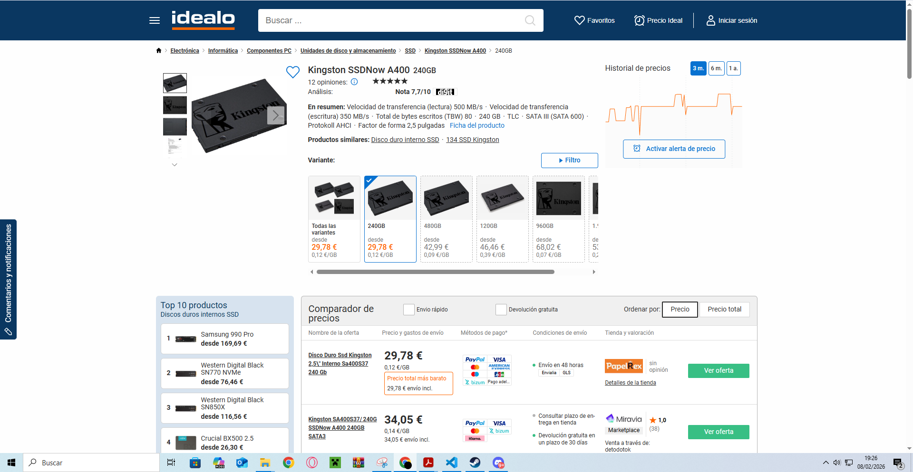   |
| **Almacenamiento** | UNYKAch Adaptador  | 2.5" a 3.5"         |   7,00€   | Amazon   | [Enlace](https://www.amazon.es/UNYKAch-Adaptador-Dual-Cable-Accesorios/dp/B08NPY1Z38/)                          | 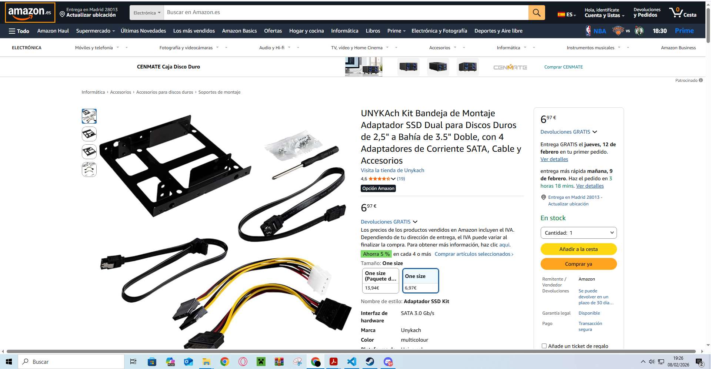     |
| **Memoria RAM**    | HP (Segunda mano)  | 4x4GB DDR2 667MHz   |     7€     | Wallapop | [Enlace](https://es.wallapop.com/item/4x-hp-4gb-ddr2-667mhz-memoria-ram-1183375565)                             | 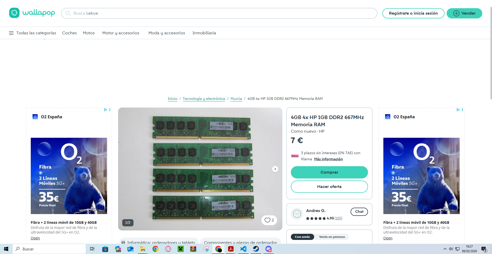    |
| **Memoria RAM**    | Rasalas Compatible | DDR2 800MHz         |    16€    | Amazon   | [Enlace](https://www.amazon.es/Rasalas-PC2-6400-DDR2-800-PC2-6400U-Unbuffered/dp/B08LD9H2HM/)                   | 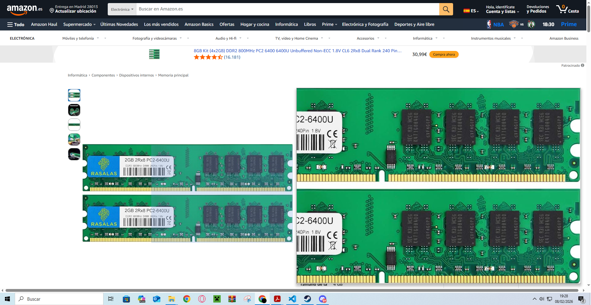    |
| **Mantenimiento**  | Corsair TM30       | Pasta Térmica      |     6€     | Amazon   | [Enlace](https://www.amazon.es/Corsair-TM30-Rendimiento-Ventilador-intermedio/dp/B07KQ1T158/)                   | 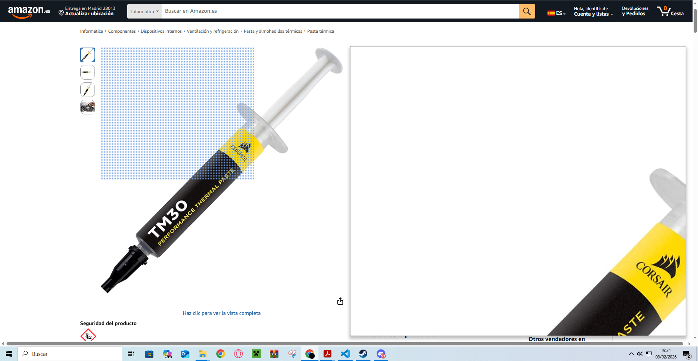   |
| **Mantenimiento**  | SIENOC             | Filtros Grandes     |   7,00€   | Amazon   | [Enlace](https://www.amazon.es/SIENOC-computadora-Ventilador-Enfriador-magn%C3%A9tica/dp/B08QYRNHF9/)           | 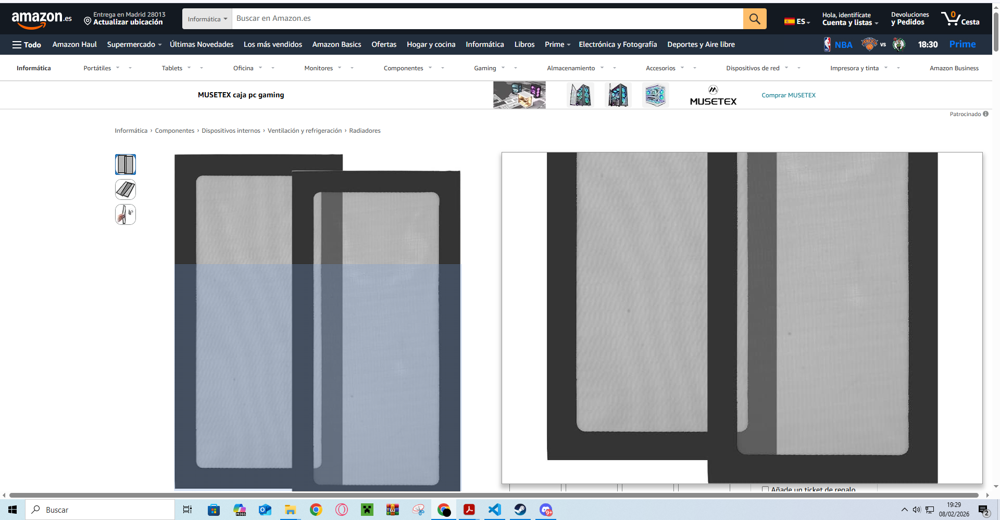      |
| **Mantenimiento**  | YIMATEECO          | Filtros Pequeños   |   7,00€   | Amazon   | [Enlace](https://www.amazon.es/YIMATEECO-Magn%C3%A9tico-Ventilador-Refrigeraci%C3%B3n-Ordenador/dp/B0D128N4SS/) | 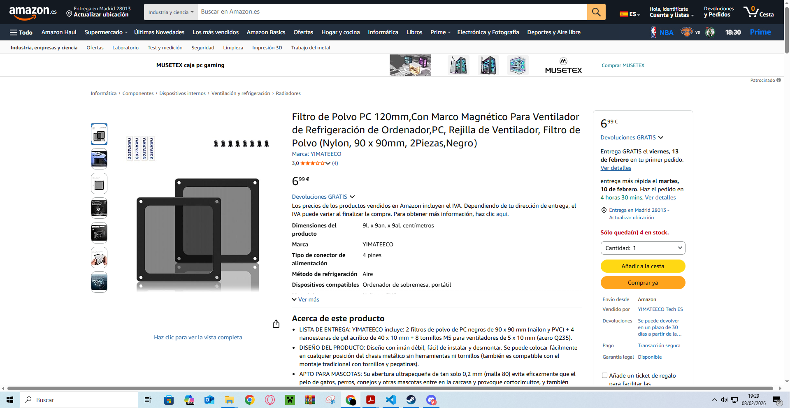      |
| **Otros**          | Bingfu             | Antena Wi-Fi USB    |    10€    | Amazon   | [Enlace](https://www.amazon.es/Bingfu-Enrutador-Inal%C3%A1mbrica-Adaptador-Videovigilancia/dp/B08YMYZGG1/)      | 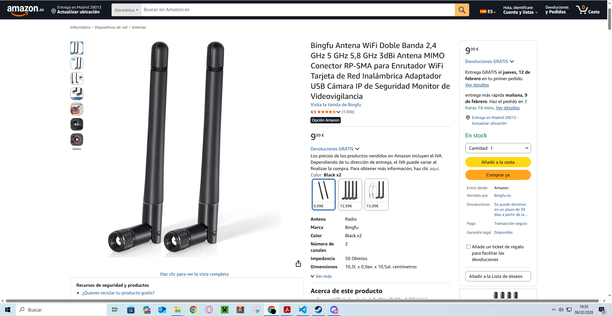  |
| **Otros**          | Genérico          | Barra de Sonido     |   8,80€   | Amazon   | [Enlace](https://www.amazon.es/Gen%C3%A9rico-Barras-Sonido-%C3%93ptica-AUX-Subwoofer/dp/B0FWQF9NH1/)            | 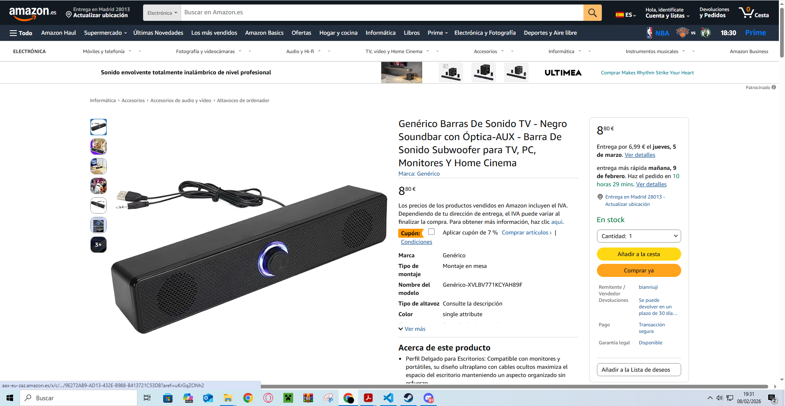 |

#### 2) Compatibilidad técnica (justifica con datos)

Para **cada pieza** elegida, justifica la **compatibilidad** con tu lote:

- **RAM:** tipo (DDR2/DDR3), voltaje (1.5 V/1.35 V), frecuencia soportada por la placa/CPU, **slots libres**.
- **SSD:** interfaz **SATA**, formato **2.5"**, bahías/adaptadores disponibles.
- **Otros:** puertos USB necesarios, espacio físico en chasis.

> Incluye captura de **fuente oficial** (manual/hoja técnica de la placa o del fabricante de la pieza) donde se vea el dato clave (ej.: “hasta 8 GB DDR2-1600”).

### 3) Mini‑estimación de impacto (sentido común + referencias)

- **De HDD a SSD:** arranques/aperturas más rápidas (órdenes de magnitud).
.
- **Pasta térmica/limpieza:** menos temperatura/ruido → estabilidad.

> **No** se piden benchmarks. Usa criterio y referencias de fuentes fiables.
> Entendido, vamos a darle un formato mucho más directo, visual y fácil de leer utilizando negritas y puntos de lista para resaltar los datos técnicos críticos de tu Compaq DC7800 SFF.

#### 3.2) Compatibilidad técnica (justifica con datos)

**Memoria RAM**

- **Tipo de memoria:** Debe ser estrictamente DDR2 SDRAM (Non-ECC). Esta placa no físicamente compatible con DDR3 o versiones posteriores.
- **Frecuencia soportada:** El límite de la placa son 800 MHz (PC2-6400). Puedes instalar memorias de 667 MHz, pero para obtener el mejor rendimiento se recomiendan las de 800 MHz.
- **Voltaje:** Funciona a 1.8 V. Es importante no confundir con voltajes menores de tecnologías más modernas.
- **Capacidad máxima:** Soporta hasta 8 GB en total.
- **Slots libres:** La placa cuenta con 4 slots de memoria. Para llegar a los 8 GB, debes ocupar todos los slots con módulos de 2 GB cada uno.

**Disco SSD**

- **Interfaz de conexión:** Utiliza SATA II (3.0 Gb/s). Es compatible con SATA III aunque limitara la velocidad.
- **Formato físico:** Debe ser de 2.5 pulgadas.
- **Bahías y montaje:** El chasis SFF está diseñado para discos de 3.5". Para que el SSD quede fijo y seguro, es indispensable usar un adaptador de bahía (bracket) de 3.5" a 2.5".
- **Puertos disponibles:** Tiene 3 conectores SATA en la placa base para distribuir entre el SSD y la unidad de DVD.

**[FUENTE](https://h10032.www1.hp.com/ctg/Manual/c01168616.pdf)**

**Otros componentes y Chasis**

- **Espacio físico:** Al ser un chasis SFF (Small Form Factor),
  El espacio es reducido y la disipacion de temperatura es reducida.

### 4) Escenario elegido y desglose de gasto (S0/S1/S2)

Completa la tabla con tu **propuesta final** y calcula el **gasto HW** total (sin mano de obra):

| **Escenario** | **Pieza**                    | **Precio (€)** | **Unidades** | **Subtotal (€)** | **Nota**              |
| --------------- | ------------------------------ | ----------------- | -------------- | ------------------- | ----------------------- |
| S1            | Pasta Térmica Corsair TM30  | 6,00€          | 1            | 6,00              | Barata, Buena marca              |
| S1            | Filtros de polvo magnéticos | 7,00€          | 1            | 7,00              | No tienen asi que estaria bien |
| S1            | Antena Wi-Fi (Bingfu)        | 10,00€         | 1            | 10,00             | Falta antena    |
| S1            | Altavoz (Barra de sonido)    | 8,80€          | 1            | 8,80              | USB/AUX               |
| S1            | RAM DDR2 800 (Rasalas)       | 16,00€         | 1            | 16,00             |  compatible        |
| S1            | SSD Kingston A400 240GB      | 29,73€         | 1            | 29,73             | SATA 3(vía Idealo)  |
| S1            | Adaptador 2.5" a 3.5"        | 7,00€          | 1            | 7,00              | Para fijar el SSD     |
| **Total HW**  |                    |          |                 |              | **84,53 €**      |                       |

### 30 — Instalación y post‑instalación

- Pasos de instalación .
Para empezar se le hara un mantenimiento a los ordenadores y se les intalaran lo que les haga falta.
Cambio de pasta termica, cambio de disco duro HDD por un SSD
y instalacion de memorias RAM.
Cambio de ajustes en la BIOS para mejorar la seguridad y permitir una mejor instalacion y compatibilidad
Instalacion de sistema operativo: se instalara linux mynt usando una iso con ventoy o rufus dependiendo de las especificaciones de la BIOS.
Una vez terminado la instalacion del sistema operativo se realizara la instalacion del software necesario para el usuario, aplicaciones de web, correo, videollamada, ofimática online, etc...
Se añadiran politicas de instalacion para que solamente el administrador pueda instalar programas y configurar el ordenador nosotros solo le daremos la clave al administrador para que se usen las politicas necesarias pensadas por el.
Ya habiendo hecho todo esto se hara una copia usando acronis, clonezilla o algun otro software para clonar discos o crear imagenes de las particiones del disco.
Se clonaran en los demas discos duros para luego instalarlos en los otros ordenadores, pero antes hay que cambiar los ajustes de la BIOS de todos los ordenadores,
Una vez clonados nos aseguraremos de que se han clonado bien y que no a habido ningun error. Y se procedera a ofrecerle una copia de la imagen original del disco duro al administrador para que si hay mas problemas en el futuro el encargado se encargue de hacerla o de llamarnos para instalarla de nuevo.

---

## 65 — Análisis de mercado y PVP

### Comparables (3 mínimos)

| **Plataforma**        | **Enlace**                                                                                                                                                                                                                                                                                                                | **Captura** | **Precio (€)** | **Especificación**                    | **Fecha/Hora** |
| ----------------------- | --------------------------------------------------------------------------------------------------------------------------------------------------------------------------------------------------------------------------------------------------------------------------------------------------------------------------- | ------------- | ----------------- | ---------------------------------------- | ---------------- |
| **eBay **             | [HP 705 G2](https://www.ebay.es/itm/296742939208)                                                                                                                                                                                                                                                                         |       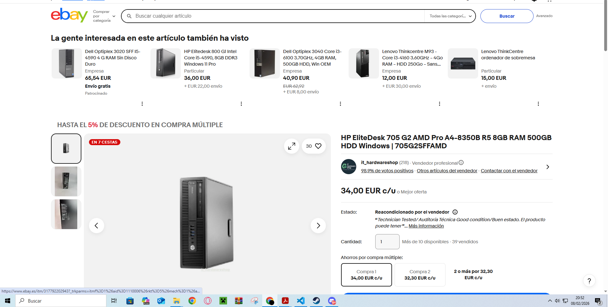      | **34,00**       | AMD Pro A4-8350B, 8GB RAM, 500GB HDD   | 08/02/26 20:45 |
| **Repuestos fuentes** | [Lenovo M73](https://www.repuestosfuentes.es/torre-lenovo-thinkcentre-m73-core-i5-4430-4gb-500gb-buen-estado-windows-11-102015.html?gad_source=1&gad_campaignid=17416708492&gbraid=0AAAAADyE4gP3e-EfREE84XyTBOInZ9ptt&gclid=Cj0KCQiAhaHMBhD2ARIsAPAU_D5IcDES3c6kVmlLie6TsQqZ6HnXMX_77wd9kSQhClsfbHNdMbW36pAaAjKZEALw_wcB) |      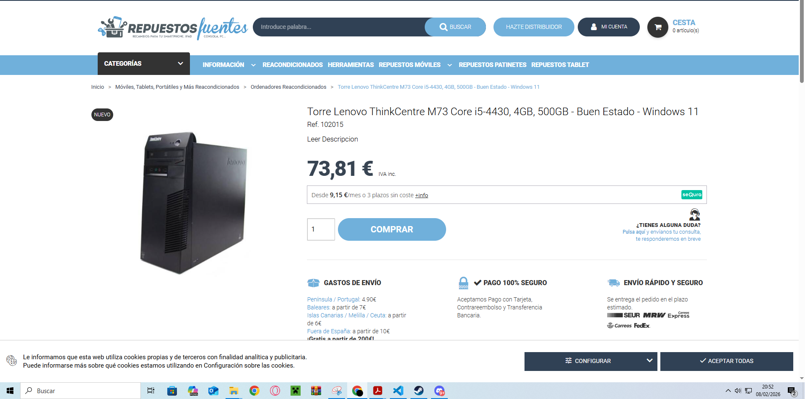       | **73,81**       | Intel Core i5-4430, 4GB RAM, 500GB HDD | 08/02/26 20:45 |
| **ebay**              | [Optiplex 3050](https://www.ebay.es/itm/296814882914?var=0&mkevt=1&mkcid=1&mkrid=1185-53479-19255-0&campid=5338727189&toolid=20006&_ul=ES&customid=Cj0KCQiAhaHMBhD2ARIsAPAU_D7Ov1uAiV8NxBqb62RUOOoyvcHZ7kH0-oy4vFu_sKty4tMAFWayx6EaAlxhEALw_wcB)                                                                          |        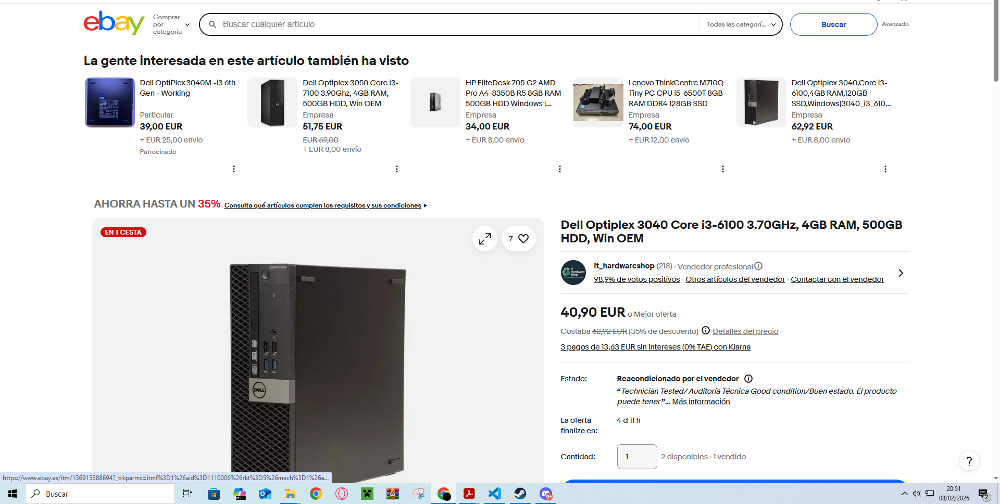     |      **51,75**           |             Dell Optiplex 3050 Core i3-7100 3.90Ghz, 4GB RAM, 500GB HDD, Win OEM                 | 08/02/26 20:57    |

### PVP objetivo

- Media precios comparables:53,19 €
- Margen de competitividad: 60 %
- **PVP objetivo:** 200 €

---

## 75 — Plan de presupuesto (HW)

**Escenario 1:**No es necesario instalar nada el ordenador/es se va a usar tal cual como esta y solo se preparara el software.

**Escenario 2:**El ordenador/es solo necesita una limpieza y istalacion de software

**Escenario 3:**El ordenador/es necesita un cambio de disco duro, pasta termica, RAM y instalacion de software

| Escenario | Gasto HW | Horas | Tarifa €/h | Coste total | PVP    |ROI
| ----------- | ---------- | ------- | ------------- |----------| ------------- | -------- |
| S1        | 0 €     | 2     | 25 €       | 50 €       | 80 €  |30€
| S2        | 6 €    | 4     | 25 €       | 106 €       | 166 € |60€
| S3        | 51,73€    | 6     |   36€    |   267,73 €     | 351,73 € |84€

**Elección final y motivos:** S3 Para esta practica porque a los ordenadores les falta recursos. Se cobra mas por hora porque a diferencia de las anteriores para esta necesitas estas mucho mas preparado y tener ciertos conocimientos previos.