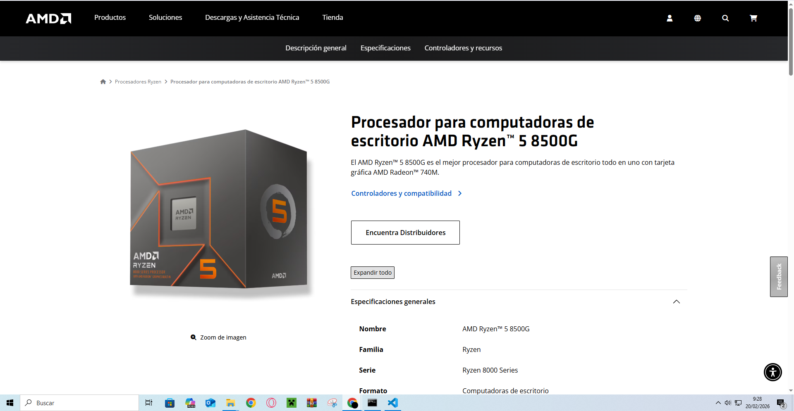
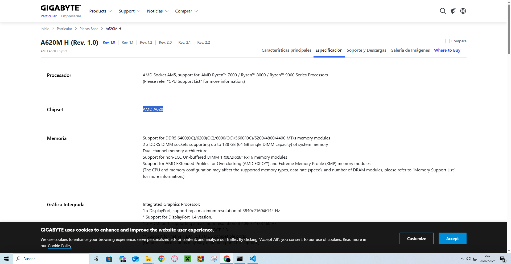
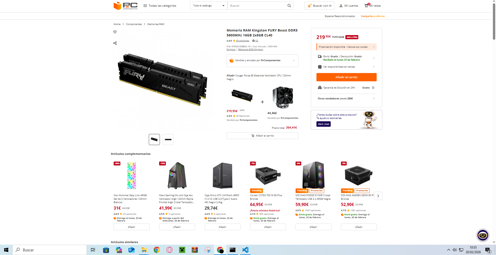
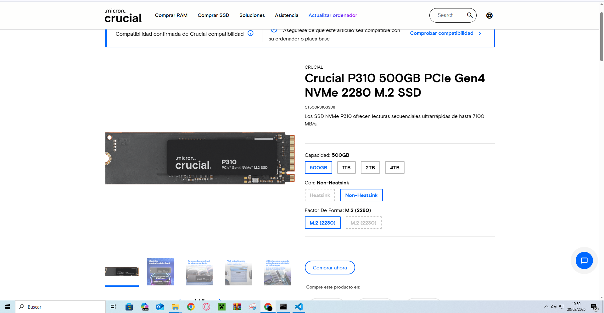
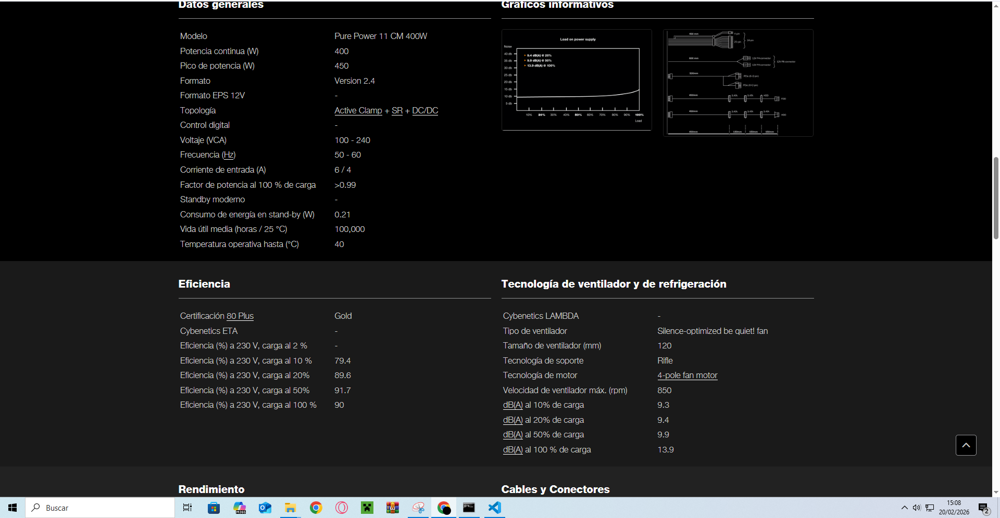
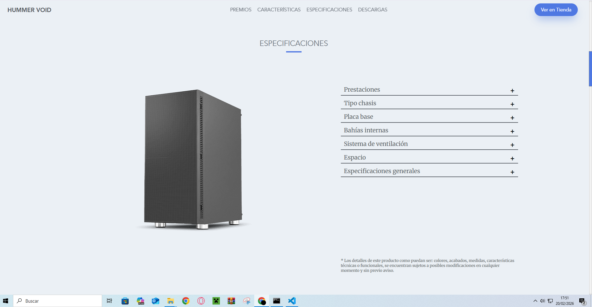

# ENTREGA ÚNICA — Reto 03 (UT3)

> Copia y pega aquí TODO lo necesario para exportar a PDF.

## 1) Portada
- **Módulo:** Fundamentos de Hardware (FHW)  
- **Unidad:** UT3  
- **Reto:** 03 — PC de oficina low-cost + Mini PC  
- **Alumno/a:** Yllán Cazorla Más 
- **Curso/Grupo:** 1º ASIR — ____  
- **Fecha:** 20/02/2026  

## 2) Opción A — PC por piezas (PASO 1–7)
# Opción A — PC de oficina por piezas (PASO 1–7)

> Rellena cada paso usando la **plantilla**. Mantén el objetivo: **oficina**, precio ajustado y componentes razonables.

## PASO 1 — CPU con gráficos integrados

Copia aquí la plantilla de `plantillas/plantilla_paso_componente.md` y rellena.
**Componente elegido:Procesador AMD Ryzen 5 8500G**

- **Marca y modelo: AMD Ryzen 5 8500G**
- **Precio (€):154,99€**
- **URL tienda:[PCcomponentes](https://www.pccomponentes.com/amd-ryzen-5-8500g-35-5ghz-box?s_kwcid=AL!14405!3!!!!x!!&gad_source=1&gad_campaignid=17335768752&gclid=Cj0KCQiAqeDMBhDcARIsAJEbU9R7RTy26Ha7jhQm_aSwZJrchE-3jhhhpvKrIr_oZyqScMN1CstpPg0aAl7QEALw_wcB)**

**Ficha técnica oficial (obligatorio):**

- [AMD](https://www.amd.com/es/products/processors/desktops/ryzen/8000-series/amd-ryzen-5-8500g.html)

**Características principales (resumen):**

- Núcleos/Hilos: 6 núcleos / 12 hilos.
- Frecuencias: Base de 4.3 GHz hasta un aumento de 5.0 GHz.
- DDR5

**Justificación (oficina):**

Me parece una buena opcion porque tiene suficiente potencia para ofimatica y me parece un buen precio.

**Compatibilidad (obligatorio, con enlaces):**

- Compatibilidad clave 1:  Socket de CPU: AM5
  - Evidencia (URL):  [AMD](https://www.amd.com/es/products/processors/desktops/ryzen/8000-series/amd-ryzen-5-8500g.html)
- Compatibilidad clave 2:  chipset que soporta:
  A620 , X670E , X670 , B650E , B650 , X870E , X870 , B840 , B850
  - Evidencia (URL):  [AMD](https://www.amd.com/es/products/processors/desktops/ryzen/8000-series/amd-ryzen-5-8500g.html)

**Captura (opcional si tu profe lo exige):**

## PASO 2 — Placa base compatible

Copia plantilla y rellena.

**Componente elegido:Placa Base Gigabyte A620M H**

- **Marca y modelo:Gigabyte A620M H**
- **Precio (€):79,99€**
- **URL tienda:[PCcomponentes](https://www.pccomponentes.com/gigabyte-a620m-h?s_kwcid=AL!14405!3!!!!x!!&gad_source=1&gad_campaignid=22157318807&gclid=Cj0KCQiAqeDMBhDcARIsAJEbU9SqbsouDtlETGEEme9TsgDgG2VWVLesGyqzk9UEryk4DCTK98h6gk8aAn2aEALw_wcB)**

**Ficha técnica oficial (obligatorio):**

- [Gigabyte](https://www.gigabyte.com/es/Motherboard/A620M-H-rev-10/sp)

**Características principales (resumen):**

- (Ej.: núcleos/hilos, frecuencia, DDR4/DDR5, capacidad, formato, certificación 80+, etc.)
- Tiene un conector M.2 para almacenamiento
- 2 sockets para memoria DDR5 DIMM
- 1 slot de expansion PCi expres x16
- Micro ATX
  **Justificación (oficina):**
  Tiene buena calidad precio, tiene compatibilidad con el procesador y aunque tiene pocos slots son justamente los suficientes para un pc de ofimatica.

**Compatibilidad (obligatorio, con enlaces):**

- Compatibilidad clave 1 :AMD Socket AM5
  - Evidencia (URL):[Gigabyte](https://www.gigabyte.com/es/Motherboard/A620M-H-rev-10/sp)
- Compatibilidad clave 2: Chipset AMD A620
  - Evidencia (URL):[Gigabyte](https://www.gigabyte.com/es/Motherboard/A620M-H-rev-10/sp)

**Captura (opcional si tu profe lo exige):**

## PASO 3 — Memoria RAM (mínimo 8 GB)

**Componente elegido:Memoria RAM Kingston FURY Beast DDR5 5600MHz 16GB 2x8GB CL40**

- **Marca y modelo: Kingston FURY Beast**
- **Precio (€):219,95€**
- **URL tienda:[PCcomponentes](https://www.pccomponentes.com/kingston-fury-beast-ddr5-5600mhz-16gb-2x8gb-cl40?s_kwcid=AL!14405!3!!!!x!!&gad_source=1&gad_campaignid=21435331652&gclid=Cj0KCQiAqeDMBhDcARIsAJEbU9QXa4teudtkLOLcujUR8wSnrC4Y8xZWwLlldwa4G9ApmqvCzaublWwaAs7pEALw_wcB)**

**Ficha técnica oficial (obligatorio):**

- [Kingston](https://www.kingston.com/latam/memory/gaming/kingston-fury-beast-ddr5-memory?speed=5600mt%2Fs&total%20(kit)%20capacity=16gb&kit=kit%20of%202&cas%20latency=40&dram%20density=16gbit&profile%20type=intel%20xmp&color=black)

**Características principales (resumen):**

- DDR5 5600MHz
- CL40

**Justificación (oficina):**

- Aunque el precio ahora mismo es caro si queremos ddr5  y aprobechar el dual chanel de la placa necesitaremos 2 modulos minimo
  **Compatibilidad (obligatorio, con enlaces):**
- Compatibilidad clave 1: 288-pin DIMM

  - Evidencia (URL):  [PCcomponentes](https://www.pccomponentes.com/kingston-fury-beast-ddr5-5600mhz-16gb-2x8gb-cl40?s_kwcid=AL!14405!3!!!!x!!&gad_source=1&gad_campaignid=21435331652&gclid=Cj0KCQiAqeDMBhDcARIsAJEbU9QXa4teudtkLOLcujUR8wSnrC4Y8xZWwLlldwa4G9ApmqvCzaublWwaAs7pEALw_wcB)
- Compatibilidad clave 2:  DDR5

  - Evidencia (URL):  [PCcomponentes](https://www.pccomponentes.com/kingston-fury-beast-ddr5-5600mhz-16gb-2x8gb-cl40?s_kwcid=AL!14405!3!!!!x!!&gad_source=1&gad_campaignid=21435331652&gclid=Cj0KCQiAqeDMBhDcARIsAJEbU9QXa4teudtkLOLcujUR8wSnrC4Y8xZWwLlldwa4G9ApmqvCzaublWwaAs7pEALw_wcB)

**Captura (opcional si tu profe lo exige):**

## PASO 4 — Almacenamiento (SSD)

**Componente elegido:Disco Duro Crucial 500GB SSD M.2 6600MB/s PCIe 4.0 NVMe P310 + Alta eficiencia**

- **Marca y modelo: Crucial**
- **Precio (€):116,99€**
- **URL tienda:[PCcomponentes](https://www.pccomponentes.com/disco-duro-crucial-500gb-ssd-m2-6600mb-s-pcie-40-nvme-p310-alta-eficiencia?s_kwcid=AL!14405!3!788120513165!!!g!311777763802!&gad_source=1&gad_campaignid=23361464617&gclid=Cj0KCQiAqeDMBhDcARIsAJEbU9SIg4MeAO_tZ3VjhsZjTLY0yHEKFt4tbBRbsU2xUPYM5jt_UdajL2YaAlnAEALw_wcB)**

**Ficha técnica oficial (obligatorio):**

- [Crucial](https://www.crucial.es/ssd/p310/ct500p310ssd8)

**Características principales (resumen):**

- Formato M.2
- PCIE 4
- 500 GB
  **Justificación (oficina):**
- Es buena opcion por calidad precio ademas de ser compatible con la placa. Se podria comprar hasta 1 TB si se deseara.
  **Compatibilidad (obligatorio, con enlaces):**
- Compatibilidad clave 1: M.2 (2280)
  - Evidencia (URL):[Crucial](https://www.crucial.es/ssd/p310/ct500p310ssd8)
- Compatibilidad clave 2: PCIE 4
  - Evidencia (URL):[Crucial](https://www.crucial.es/ssd/p310/ct500p310ssd8)

**Captura (opcional si tu profe lo exige):**

- ``

## PASO 5 — Fuente (PSU)

## PASO X — [Nombre del componente]

**Componente elegido:Be Quiet! Pure Power 11 CM 400W 80 Plus Gold Semi Modular**

- **Marca y modelo:Be Quiet Pure Power**
- **Precio (€):67,99**
- **URL tienda:[PCcomponentes](https://www.pccomponentes.com/be-quiet-pure-power-11-cm-400w-80-plus-gold-semi-modular?srsltid=AfmBOoou3-Qu5UGXo7PydI6nLK2VwFKcjkrcn7J5KebjK4CO_LhsrjPC)**

**Ficha técnica oficial (obligatorio):**

- [Be quiet](https://www.bequiet.com/es/powersupply/1539)

**Características principales (resumen):**

- Semi modular
- 400 W
- 80 plus Gold
- silenciosa
  **Justificación (oficina):**
- Explica por qué es buena opción para: navegar, ofimática, vídeo ligero, consumo, ruido, etc.

**Compatibilidad (obligatorio, con enlaces):**

- Compatibilidad clave 1:Factor de forma  ATX
  - Evidencia (URL): [Be quiet](https://www.bequiet.com/es/powersupply/1539)
- Compatibilidad clave 2: tiene los cables exactos para la placa y le sobra potencia
  - Evidencia (URL): [Be quiet](https://www.bequiet.com/es/powersupply/1539)

**Captura (opcional si tu profe lo exige):**

## PASO 6 — Chasis

**Componente elegido:Torre PC Nox Hummer Void USB 3.0 Negro**

- **Marca y modelo:Nox HUmmer void**
- **Precio (€):49,90**
- **URL tienda:[PCcomponentes](https://www.pccomponentes.com/nox-hummer-void-usb-30-negro?utm_source=624709&utm_medium=afi&utm_campaign=www.google.com&sv1=affiliate&sv_campaign_id=624709&awc=20981_1771596600_0d90d7c3d20f18b582a9239710702dc9&utm_term=deeplink&utm_content=09fbe2aaa1eb900faae9be1cdf3964f4)**

**Ficha técnica oficial (obligatorio):**

- [nox](https://www.nox-xtreme.com/cajas/hummer-void)

**Características principales (resumen):**

- Capacidad para hasta 6 ventiladores
- paneles con cancelacion acustica
- puede tener refrigeracion liquida
  **Justificación (oficina):**
- Me parece que es muy buena en calidad precio ademas de ser compatible con los anteriores componentes, que tenga cancelacion acustica me parece muy buena idea para trabajar en ofimatica porque al final de tanto escuchar los ventiladores te acabas cansando.

**Compatibilidad (obligatorio, con enlaces):**

- Compatibilidad clave 1:soporte para placa microATX
  - Evidencia (URL): - [nox](https://www.nox-xtreme.com/cajas/hummer-void)
- Compatibilidad clave 2:  compartimiento apto para fuentes de alimentacion ATX
  - Evidencia (URL):  - [nox](https://www.nox-xtreme.com/cajas/hummer-void)

**Captura (opcional si tu profe lo exige):**

## PASO 7 — Presupuesto final

- Para el presupuesto e preferido buscar por calidad/precio ademas de buscar que el ordenador pueda dura bastantes años.
- Los unicos cambios que haria seria a la placa si se desea todavia mas potencia porque esta limitada por los slots de memoria. Pero como era de ofimatica me parece que la eleccion que e hecho tiene potencia de sobra para ofimatica.

| **Componente**              | **Modelo**                                    | **Precio (€)** | **URL tienda**                                                                                                                                                                                                                                                                                                         |
| ----------------------------- | ----------------------------------------------- | ----------------- | ------------------------------------------------------------------------------------------------------------------------------------------------------------------------------------------------------------------------------------------------------------------------------------------------------------------------ |
| **CPU**                     | AMD Ryzen 5 8500G                             | 154,99 €       | [PcComponentes](https://www.pccomponentes.com/amd-ryzen-5-8500g-35-5ghz-box?s_kwcid=AL!14405!3!!!!x!!&gad_source=1&gad_campaignid=17335768752&gclid=Cj0KCQiAqeDMBhDcARIsAJEbU9R7RTy26Ha7jhQm_aSwZJrchE-3jhhhpvKrIr_oZyqScMN1CstpPg0aAl7QEALw_wcB)                                                                      |
| **Placa base**              | Gigabyte A620M H                              | 79,99 €        | [PcComponentes](https://www.pccomponentes.com/gigabyte-a620m-h?s_kwcid=AL!14405!3!!!!x!!&gad_source=1&gad_campaignid=22157318807&gclid=Cj0KCQiAqeDMBhDcARIsAJEbU9SqbsouDtlETGEEme9TsgDgG2VWVLesGyqzk9UEryk4DCTK98h6gk8aAn2aEALw_wcB)                                                                                   |
| **RAM**                     | Kingston FURY Beast DDR5 5600MHz 16GB (2x8GB) | 219,95 €       | [PcComponentes](https://www.pccomponentes.com/kingston-fury-beast-ddr5-5600mhz-16gb-2x8gb-cl40?s_kwcid=AL!14405!3!!!!x!!&gad_source=1&gad_campaignid=21435331652&gclid=Cj0KCQiAqeDMBhDcARIsAJEbU9QXa4teudtkLOLcujUR8wSnrC4Y8xZWwLlldwa4G9ApmqvCzaublWwaAs7pEALw_wcB)                                                   |
| **SSD**                     | Crucial P310 500GB SSD M.2 PCIe 4.0           | 116,99 €       | [PcComponentes](https://www.pccomponentes.com/disco-duro-crucial-500gb-ssd-m2-6600mb-s-pcie-40-nvme-p310-alta-eficiencia?s_kwcid=AL!14405!3!788120513165!!!g!311777763802!&gad_source=1&gad_campaignid=23361464617&gclid=Cj0KCQiAqeDMBhDcARIsAJEbU9SIg4MeAO_tZ3VjhsZjTLY0yHEKFt4tbBRbsU2xUPYM5jt_UdajL2YaAlnAEALw_wcB) |
| **Fuente de alimentación** | Be Quiet! Pure Power 11 CM 400W 80 Plus Gold  | 67,99 €        | [PcComponentes](https://www.pccomponentes.com/be-quiet-pure-power-11-cm-400w-80-plus-gold-semi-modular?srsltid=AfmBOoou3-Qu5UGXo7PydI6nLK2VwFKcjkrcn7J5KebjK4CO_LhsrjPC)                                                                                                                                               |
| **Chasis**                  | Nox Hummer Void USB 3.0 Negro                 | 49,90 €        | [PcComponentes](https://www.pccomponentes.com/nox-hummer-void-usb-30-negro?utm_source=624709&utm_medium=afi&utm_campaign=www.google.com&sv1=affiliate&sv_campaign_id=624709&awc=20981_1771596600_0d90d7c3d20f18b582a9239710702dc9&utm_term=deeplink&utm_content=09fbe2aaa1eb900faae9be1cdf3964f4)                      |
| **TOTAL**                   |                                               | **689,81 €**   |                                                                                                                                                                                                                                                                                                                        |

## 3) Opción B — Mini PC (PASO 8)
# Opción B — Mini PC ya montado (PASO 8)

Elige **1 Mini PC** ya montado y complétalo con enlaces y justificación.

## PASO 8 — Mini PC (ya montado)

**Producto elegido:Beelink EQR6 AMD Ryzen 6600U/6800U**

- **Marca y modelo exacto:Beelink EQR6**
- **Precio (€):479,00€**
- **URL tienda:[Beelink](https://www.bee-link.com/es/products/beelink-eqr6?variant=47885188038898)**

**Ficha técnica oficial (obligatorio):**

- [Beelink](https://www.bee-link.com/es/products/beelink-eqr6?variant=47885188038898)

**Especificaciones:**

- CPU: AMD Ryzen™ 5 6600U (6 núcleos / 12 hilos, hasta 4.5 GHz).
- RAM: 32 GB LPDDR5 (Soldada en placa base).
- SSD/almacenamiento: SSD de 1 TB M.2 PCIe 4.0 NVMe.
- Conectividad (Wi‑Fi/Ethernet/USB/vídeo): Wi-Fi 6 (AX200), Bluetooth 5.2, doble puerto Ethernet LAN 1000M, 2x HDMI (Soporte 4K), 3x USB 3.2, 1x USB 2.0 y 1x USB Tipo-C.
- Tamaño / consumo: Muy compacto (126 x 126 x 45.5 mm) / 520 gramos de peso. Tiene una fuente de alimentación de 85W integrada dentro del propio equipo.

**Ventajas (mínimo 4):**

- Ocupa muy poco espacio
- Precio /Calidad muy bueno
- fuente de alimentacion interna.
- Viene con licencia y ya instalada del sistema operativo windows 11 PRO

**Contras (mínimo 4):**

- No se puede modificar ni cambiar nada de dentro
- Poco tiempo de vida comparado a un pc tradicional
  **¿Para qué oficina SÍ / para qué NO?**
- Sí:Es perfecto para oficinas con poco espacio para gente que teletrabaja la mitad del tiempo porque le permite llevarselo a su casa facilmente
- No:No sirve para oficinas que quieran ordenadores que duren bastante tiempo y que quieran actualizar sus componentes

**Compatibilidad/ampliación (con enlaces):**

- ¿Se puede ampliar RAM? evidencia:No se puede porque es una LPDDR5 que viene soldada
- ¿Se puede ampliar SSD? evidencia:Si de hecho tiene otra ranura libre para poner otro disco duro adicional

## Comparación rápida A vs B

Rellena esta tabla:

| **Aspecto**                        | **Opción A (por piezas)**                                                                              | **Opción B (Mini PC Beelink EQR6)**                                                                       |
| ------------------------------------ | --------------------------------------------------------------------------------------------------------- | ------------------------------------------------------------------------------------------------------------ |
| **Precio total**                   | 689,81 € (Sin licencia de Windows)                                                                     | 479,00 € (Con Windows 11 Pro incluido)                                                                    |
| **Rendimiento esperado (oficina)** | **Sobresaliente:** Procesador más moderno y rápido (Ryzen 8500G).                                     | **Sobresaliente:** Procesador un poco más antiguo, pero con el doble de RAM (32 GB).                      |
| **Ampliación (RAM/SSD)**          | **Total:** Se puede ampliar RAM, SSD, cambiar el procesador o añadir tarjeta gráfica.                 | **Limitada:** Se puede añadir un segundo SSD, pero la RAM viene soldada y no se puede tocar.              |
| **Consumo/ruido/espacio**          | Bajo consumo / Inaudible (caja insonorizada) / Ocupa espacio de torre normal en la mesa o suelo.        | Consumo mínimo / Prácticamente inaudible / Espacio cero (cabe en la palma de la mano o tras el monitor). |
| **Facilidad de despliegue**        | **Baja:** Hay que montar las piezas a mano e instalar el sistema operativo desde cero.                  | **Alta (Plug & Play):** Sacar de la caja, enchufar a la corriente y empezar a trabajar.                    |
| **Garantía/soporte**              | **Por componentes:** Si se rompe una pieza, tramitas la garantía de esa pieza y el PC sigue sirviendo. | **Global:** Si falla la placa o la fuente interna, hay que enviar el equipo entero al servicio técnico.   |

## 4) Checklist de compatibilidad
# Checklist de compatibilidad (OBLIGATORIO)

Piensa en esto como un **“enchufe y llaves”**:

- El **socket** es la “cerradura” de la placa base.
- La **CPU** es la “llave”.
  Si no coincide, no entra.

Rellena con ✅ + enlaces de evidencia.

## Opción A (por piezas)

| **Compatibilidad**                                          | **Evidencia (enlace)**                                                                                           | **OK** |
| ------------------------------------------------------------- | ------------------------------------------------------------------------------------------------------------------ | -------- |
| **CPU ↔ Placa base** (socket AM5 / chipset A620 soportado) | [Especificaciones Gigabyte (Apartado CPU)](https://www.gigabyte.com/es/Motherboard/A620M-H-rev-10/sp)            | ✅     |
| **RAM ↔ Placa base** (DDR5, velocidad soportada)           | [Especificaciones Gigabyte (Apartado Memoria)](https://www.gigabyte.com/es/Motherboard/A620M-H-rev-10/sp)        | ✅     |
| **SSD ↔ Placa base** (M.2 NVMe PCIe 4.0)                   | [Especificaciones Gigabyte (Apartado Almacenamiento)](https://www.gigabyte.com/es/Motherboard/A620M-H-rev-10/sp) | ✅     |
| **PSU ↔ Placa base** (24-pin ATX, EPS 8-pin si aplica)     | [Cables incluidos be quiet! Pure Power 11 CM](https://www.bequiet.com/es/powersupply/1539)                       | ✅     |
| **Chasis ↔ Placa base** (ATX/mATX/ITX)                     | [Ficha Nox Hummer Void (Soporta Micro-ATX)](https://www.nox-xtreme.com/cajas/hummer-void)                        | ✅     |
| **Chasis ↔ PSU** (ATX/SFX/TFX)                             | [Ficha Nox Hummer Void (Soporta fuente ATX estándar)](https://www.nox-xtreme.com/cajas/hummer-void)             | ✅     |

## Opción B (Mini PC)

| **Punto a verificar**                                                    | **Evidencia (enlace)**                                                                                                                  | **OK** |
| -------------------------------------------------------------------------- | ----------------------------------------------------------------------------------------------------------------------------------------- | -------- |
| **RAM ampliable** (NO, viene soldada de fábrica)                        | [Ficha Beelink EQR6 (LPDDR5 Built-in memory, not expandable)](https://www.bee-link.com/es/products/beelink-eqr6?variant=47885188038898) | ❌     |
| **SSD ampliable** (SÍ, tiene 2 ranuras M.2 PCIe 4.0 hasta 8TB)          | [Ficha Beelink EQR6 (Dual M.2 PCIe 4.0 Slots)](https://www.bee-link.com/es/products/beelink-eqr6?variant=47885188038898)                | ✅     |
| **Conectividad** (Wi‑Fi 6, 2x Ethernet LAN, USB-C, 3x USB 3.2, 2x HDMI) | [Ficha Beelink EQR6 (Apartado Ports &amp; Wireless)](https://www.bee-link.com/es/products/beelink-eqr6?variant=47885188038898)          | ✅     |

## 5) Conclusión final
En opcion para ofimatica a mi parecer ahora mismo elegiria la torre custom porque a lo largo del tiempo se revalorizara la inversion porque al durar bastante tiempo permite a la empresa no perder tanto dinero cada vez que haya una averia.
Otra opcion seria comprar el mini PC pensando en que los precios acabaran bajando porque ahora mismo estan muy caros los precios por PC.
Esta practica nos a enseñado a elegir segun la compatibilidad y caracteristicas de los componentes para PC.